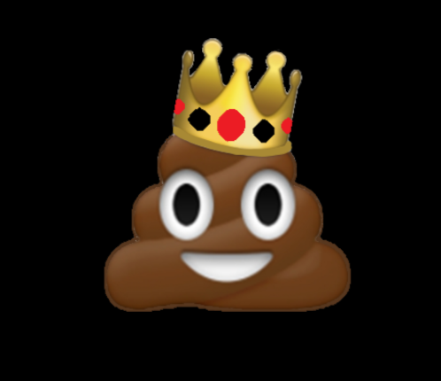

Competitive baseball for as long as I can remember throughout high-school! Ton of practice to maintain my spot on top tier showcase team for
Prodigy, JCCC Cavaliers showcase team, and Cubs. 

**Here is a Link to my Berecruited Page I used to use.**

[Berecruited Page](https://new.berecruited.com/athletes/4157331#athletics)

I've been having a insane time as a player for the Mizzou Esports Program and would like to thank a lot of people for this opportunity. We've been flown out to Atlanta to compete for a national championship title as well as playing on stage in front of my mom and sister and about a hundred people. It was the most fun I've had as a gamer. 

##### Here's what I rock as my profile picture as a png in this repo.

Back to Home --> [README.md](https://github.com/RileyPut7/RIleyPut7/edit/master/README.md)
